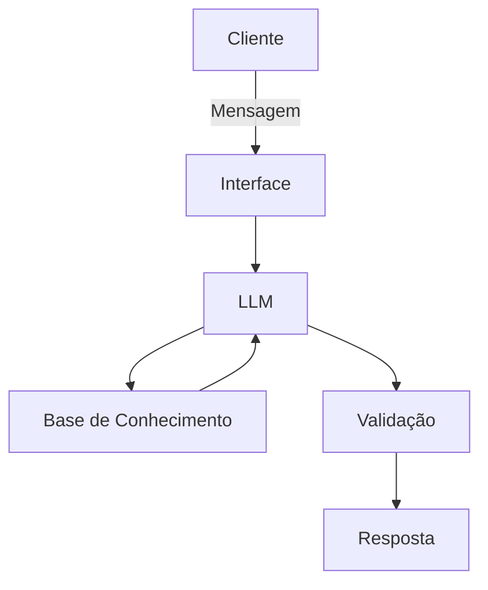

# Documentação do Agente

## Caso de Uso

### Problema
> Qual problema financeiro seu agente resolve?

Falta de educação financeira quando usa cartão de crédito.

### Solução
> Como o agente resolve esse problema de forma proativa?

Um agente inteligente que funciona como um “agente financeiro do cartão de crédito”, educando, alertando e intervindo antes do erro acontecer.

### Público-Alvo
> Quem vai usar esse agente?

Foque em jovens adultos (22–35 anos) usuários de bancos digitais.

---

## Persona e Tom de Voz

### Nome do Agente
CrediMente

### Personalidade
> Como o agente se comporta? (ex: consultivo, direto, educativo)

proteção + inteligência + controle + educação, sem parecer chato ou moralista.

### Tom de Comunicação
> Formal, informal, técnico, acessível?

Formal

### Exemplos de Linguagem
- Saudação: [ex: "Olá! Estou aqui para te ajudar a usar seu cartão com mais segurança. O que você quer analisar hoje?"]
- Confirmação: [ex: "Perfeito, vou calcular o impacto dessa compra."]
- Erro/Limitação: [ex: "Não tenho acesso direto a essa informação agora, mas posso estimar com base nos seus dados recentes."]

---

## Arquitetura

### Diagrama

### Componentes

| Componente | Descrição |
|------------|-----------|
| Interface | [ex: Streamlit] |
| LLM | [ex: Ollama (local)] |
| Base de Conhecimento | [ex: JSON/CSV com dados do mockados] |
| Validação | [ex: Checagem de alucinações] |

---

## Segurança e Anti-Alucinação

### Estratégias Adotadas

- [ ] [ex: Agente só responde com base nos dados fornecidos]
- [ ] [ex: Quando não sabe, admite e redireciona]
- [ ] [ex: Não faz recomendações de investimento sem perfil do cliente]

### Limitações Declaradas
> O que o agente NÃO faz?

- Não acessa dados bancarios sensiveis.
- Não acessa o cartão de credito do usuário.
